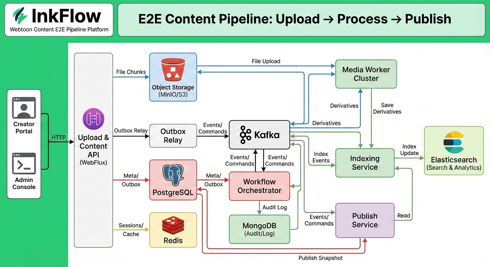

# InkFlow

글로벌 작가/협업사가 업로드한 대용량 콘텐츠(이미지/비디오/전자책)를 **끊김 없이 수집(Resumable Upload)** 하고, **마감 → 검수 → 변환 → 패키징 → 퍼블리시**까지를 **이벤트 기반 파이프라인**으로 처리하는 백엔드 플랫폼입니다.



## 핵심 가치
- **정합성**: Outbox 패턴으로 상태 변경과 이벤트 발행을 트랜잭션 단위로 묶습니다.
- **멱등성**: API/컨슈머/미디어 작업 전 구간에서 중복 처리를 방지합니다.
- **확장성**: Kafka + 워커 수평 확장으로 비동기 파생 작업을 처리합니다.
- **운영성**: 메트릭/트레이싱/로그 기반의 추적성과 재처리성을 보장합니다.

## 목표 / 비목표
### Goals
- Resumable Upload/Download(세션 기반 Chunk 업로드, Range 다운로드)
- E2E Workflow: `DRAFT → SUBMITTED → REVIEWING → APPROVED → PUBLISHED(→ ROLLBACK)`
- Event-driven Pipeline(Kafka + Outbox)
- Media Derivatives 비동기 처리(썸네일/리사이즈/변환)
- 글로벌 퍼블리시(스냅샷/버전/롤백)
- 검색/운영(Elasticsearch + 감사 로그)
- 관측/운영 자동화(메트릭/트레이싱/로그)

### Non-goals
- 상용 CDN/DRM/결제는 인터페이스 수준
- 대규모 ML 자동 검열은 범위 밖(확장 포인트만 정의)

## 아키텍처 개요
- **Upload & Content API(WebFlux)**: 업로드 세션/다운로드/메타 제공
- **Workflow Orchestrator**: 상태머신 기반 전이 관리
- **Media Worker**: 파생 리소스 비동기 생성
- **Publish Service**: 퍼블리시 스냅샷/롤백(고도화 단계)
- **Indexing Service**: 검색 인덱스 관리

## 워크플로우 상태 전이
`DRAFT → SUBMITTED → REVIEWING → APPROVED → PUBLISHING → PUBLISHED → ROLLED_BACK`  
`REVIEWING → REJECTED → DRAFT`

## 이벤트/Outbox/멱등성
- 상태 변경과 **OutboxEvent 기록을 동일 트랜잭션**으로 처리합니다.
- Outbox Relay가 Kafka로 발행하며, 컨슈머는 `eventId`/`idempotencyKey`로 중복을 차단합니다.
- 이벤트 envelope: `eventId`, `eventType`, `occurredAt`, `producer`, `traceId`, `payload`, `idempotencyKey`

## 데이터 스토어 역할
- **PostgreSQL**: 핵심 도메인/트랜잭션/Outbox
- **MongoDB**: 워크플로우/미디어 작업 로그, 감사 로그
- **Elasticsearch**: 작품/회차/자산 검색 및 운영 필터
- **Redis**: 업로드 세션, 분산락, 캐시, 레이트리밋

## 기술 스택
- Kotlin, Spring Boot 3.x
- WebFlux(Netty), gRPC
- Kafka, PostgreSQL, MongoDB, Elasticsearch, Redis
- MinIO/S3, OpenTelemetry, Prometheus, Grafana, Loki/ELK

## 레포 구조
```
apps/   (실행 서비스)
libs/   (공통 라이브러리)
infra/  (로컬/운영 인프라 정의)
docs/   (설계/ADR/스키마)
etc/    (프로젝트 규약/설계 문서)
```

## 로컬 개발 환경(빠른 시작)
- 인프라 구성: `infra/docker-compose.yml`
- 환경 변수 템플릿: `.env.example`

### 1) 인프라 기동
```bash
# 로컬 환경 변수 파일 준비
cp .env.example .env

# 로컬 인프라 기동
docker compose -f infra/docker-compose.yml up -d

# 상태 확인
docker compose -f infra/docker-compose.yml ps
```

### 2) MinIO 버킷 준비(선택)
- MinIO 콘솔: `http://localhost:9001` (아이디/비밀번호: `inkflow` / `inkflow_pw`)
- S3 호환 테스트를 위해 `inkflow` 버킷을 생성합니다.

### 3) 애플리케이션 실행
```bash
# .env 로드(zsh 기준)
set -a
source .env
set +a

# 애플리케이션 실행
./gradlew bootRun
```

### 로컬 인프라 포트
- PostgreSQL: `5432`
- MongoDB: `27017`
- Redis: `6379`
- Kafka: `9092`
- MinIO: `9000`(API), `9001`(Console)
- Elasticsearch: `9200`/`9300`

## 서비스 실행/포트
| 서비스 | 실행 명령 | 기본 포트 | 설명 |
| --- | --- | --- | --- |
| InkFlow(단일 앱) | `./gradlew bootRun` | `8080` | Upload API, Workflow, Outbox Relay, Media, Indexing 포함 |

- 기본 포트는 Spring Boot 기본값을 사용하며 필요 시 `SERVER_PORT`로 변경합니다.
- 향후 `apps/*` 모듈 분리 시 서비스별 실행/포트는 이 섹션에 확정 반영합니다.

## API/이벤트 예시
### 업로드 세션 생성(Upload API)
```bash
# 업로드 세션 생성 요청
curl -X POST http://localhost:8080/uploads \
  -H "Content-Type: application/json" \
  -H "Idempotency-Key: req-1234" \
  -d '{
    "episodeId": 1001,
    "filename": "episode-1.zip",
    "contentType": "application/zip",
    "size": 10485760,
    "checksum": "sha256:...",
    "totalParts": 10
  }'
```

```jsonc
// 업로드 세션 생성 응답(예시)
{
  "requestId": "req-1234",
  "code": "OK",
  "message": "success",
  "data": {
    "uploadId": "upl_123",
    "chunkSize": 5242880,
    "presignedUrls": [
      { "partNumber": 1, "url": "https://..." }
    ],
    "expiresAt": "2025-01-01T00:30:00Z"
  }
}
```

### 워크플로우 제출(Workflow API)
```bash
# 에피소드 제출 요청
curl -X POST http://localhost:8080/episodes/2001/submit \
  -H "Content-Type: application/json" \
  -H "Idempotency-Key: req-5678" \
  -d '{
    "deadline": "2025-02-01T00:00:00Z"
  }'
```

```jsonc
// 상태 전이 응답(예시)
{
  "requestId": "req-5678",
  "code": "OK",
  "message": "success",
  "data": {
    "episodeId": 2001,
    "state": "SUBMITTED",
    "version": 2
  }
}
```

### Kafka 이벤트 Envelope 예시
```jsonc
// 이벤트 envelope(예시)
{
  "eventId": "uuid",
  "eventType": "ASSET_STORED.v1",
  "occurredAt": "2025-01-01T00:00:00Z",
  "producer": "upload-api",
  "traceId": "trace-1234",
  "idempotencyKey": "req-1234",
  "payload": {
    "assetId": 1001,
    "episodeId": 2001,
    "checksum": "sha256:...",
    "size": 10485760,
    "storageKey": "assets/episode-1.zip",
    "contentType": "application/zip"
  }
}
```

## 문서
- REST API(OpenAPI): `docs/api/openapi.yaml`
- gRPC(proto): `docs/proto/inkflow/publish/v1/publish.proto`, `docs/proto/inkflow/common/v1/common.proto`

## 로드맵(요약)
- **Phase 1(MVP)**: 업로드 세션, 워크플로우, Outbox+Kafka, 썸네일 생성, 기본 검색
- **Phase 2(운영성 강화)**: DLQ/재처리, 퍼블리시 스냅샷/롤백, 관측 대시보드
- **Phase 3(글로벌/고성능)**: 지역/언어 정책, 업로드 가속, 배치/백필
